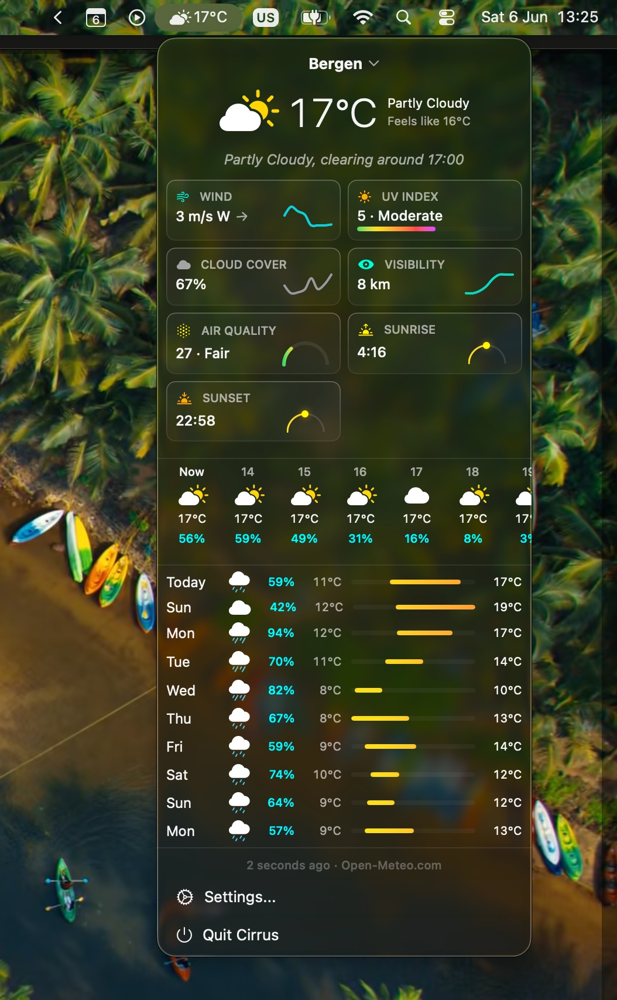

<p align="center">
  
</p>

<h1 align="center">Cirrus</h1>

<p align="center">
  A lightweight, native macOS menu bar weather app. Built with SwiftUI.
</p>

<p align="center">
  
</p>

## Install

Download the latest DMG from [Releases](https://github.com/SuperManifolds/Cirrus/releases), open it, and drag Cirrus to your Applications folder.

## Requirements

- macOS 26.4 or later (Apple Silicon)
- Location Services (optional, for auto-detect)
- Apple Intelligence (optional, for AI weather summary)

## Building

```bash
git clone https://github.com/SuperManifolds/Cirrus.git
cd Cirrus
open Cirrus.xcodeproj
```

Select your development team, then build and run.

To use the WeatherKit provider, enable the WeatherKit capability in both the **Capabilities** and **App Services** tabs in the [Apple Developer Portal](https://developer.apple.com).

## Contributing

See [CONTRIBUTING.md](CONTRIBUTING.md) for guidelines.

## Data Sources

- [Open-Meteo](https://open-meteo.com) — weather data (CC BY 4.0)
- [MET Norway](https://api.met.no) — radar precipitation nowcast
- [Apple WeatherKit](https://developer.apple.com/weatherkit/) — Apple Weather data

## License

[MIT](LICENSE)
